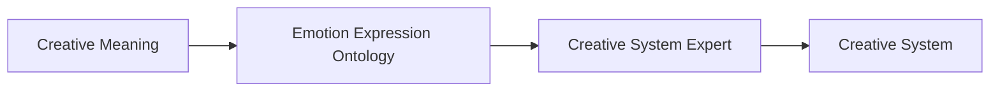
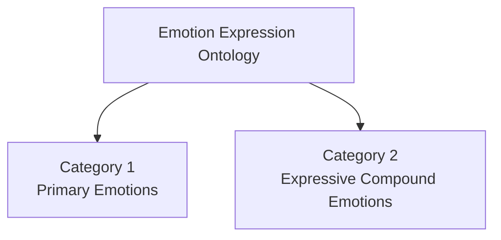
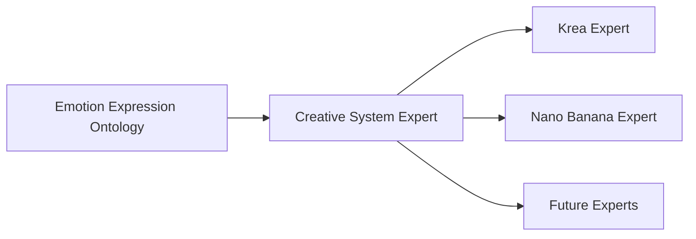

# Emotion Expression Ontology

> **A renderer-independent ontology describing observable facial anatomy that communicates emotional meaning.**

---

## Fundamental Directive

The Emotion Expression Ontology represents **only observable facial expression**.

It never describes:

- body posture
- gesture
- movement
- camera
- lighting
- composition
- narrative
- renderer implementation

Every entry must remain:

- anatomically accurate
- visually observable
- renderer independent
- semantically composable with every other VizClick ontology

---

# Purpose

The Emotion Expression Ontology describes how emotional meaning becomes visually recognizable through facial anatomy.

Rather than describing psychological states, the ontology documents the observable facial characteristics that allow an observer to recognize an emotion.

This approach provides a stable semantic representation while allowing each Creative System Expert to translate the same emotional meaning into the representation preferred by its destination renderer.



---

# Scope

Version 1 is intentionally designed for **human and human-like facial expressions**.

This reflects the objectives of the first reference implementation, **Krea Expert V1**, whose primary creative domain consists of portraiture, fashion, advertising, cinema, and humanoid characters.

The ontology therefore describes observable human facial anatomy while remaining architecturally independent from any specific renderer.

Future versions may introduce a Universal Expression Ontology capable of representing non-human facial morphologies without changing the underlying Creative Meaning.

---

# Design Principles

## Domain Purity

The Emotion Expression Ontology owns only facial expression.

It never describes:

- pose
- body language
- gesture
- movement
- lighting
- composition
- camera

Those responsibilities belong to their respective ontologies.

This separation allows multiple ontology entries to be combined without semantic conflicts.

---

## Renderer Independence

The ontology never contains:

- prompts
- renderer syntax
- software parameters
- implementation details
- FACS Action Units

Instead, it describes only observable facial anatomy.

Renderer-specific representations are the responsibility of Creative System Experts.

---

## Visual Observability

Every description must describe only characteristics that can be directly observed in an image.

Invisible emotional or psychological interpretations are intentionally excluded.

---

## Expressive Coverage

The objective of the ontology is **not** to catalog every human emotion.

Its objective is to provide the smallest curated set of visually distinct facial expressions capable of covering the overwhelming majority of emotional performances encountered in photography, cinema, illustration, animation, and AI-assisted visual creation.

Expressive coverage is prioritized over psychological completeness.

---

# Ontology Structure



## Category 1 — Primary Emotions

Thirty carefully selected primary emotions.

Each primary emotion contains two intensity levels.

- Moderate
- Expressive

Total:

**30 × 2 = 60 entries**

Primary emotions are selected because they:

- possess a visually distinct facial configuration
- are frequently used in professional acting
- are easily recognized by observers
- provide meaningful expressive coverage
- support natural compound emotions

Emotions that do not significantly expand expressive coverage should become compound emotions or future ontology extensions.

---

## Category 2 — Expressive Compound Emotions

Approximately forty carefully curated emotional combinations.

Each entry consists of:

- one dominant primary emotion
- one compatible secondary emotional modifier

Only expressive variants are included.

This maximizes visual clarity for current AI image generation systems while maintaining a compact ontology.

Examples include:

- Joy with Relief
- Joy with Surprise
- Fear with Surprise
- Fear with Relief
- Anger with Disgust
- Sadness with Hope

---

# Official Entry Schema

Every ontology entry follows the same anatomical order to maximize consistency, readability, and future translation by Creative System Experts.

```text
============================================================================
VIZCLICK ONTOLOGY

Emotion Expression Ontology

Category X

Entry ###

============================================================================

Name

Intensity

Description:

Eyebrows...

Forehead...

Upper Eyelids...

Eyes...

Lower Eyelids...

Nose...

Cheeks...

Lips...

Mouth Corners...

Jaw...

Chin...

Overall Facial Muscle Activation...
```

Descriptions should remain anatomically consistent across the entire ontology.

Every section should describe only observable facial characteristics.

---

# Translation Through Creative System Experts

The Emotion Expression Ontology remains stable.

Only its representation changes.



Examples include:

**Krea Expert**

- Detailed anatomical facial descriptions optimized for Krea.

**Nano Banana Expert**

- Facial Action Coding System (FACS) Action Units.

**Future Experts**

- Blendshape values
- Facial rig controls
- Animation parameters
- Future renderer-specific representations

The ontology itself never changes.

Only its realization evolves.

---

# Quality Standard

Every descriptor should be written as if reviewed collaboratively by:

- a facial anatomist
- a professional acting coach
- a portrait photographer
- a facial animation supervisor

Every description must satisfy the following requirements.

## Anatomical Accuracy

Descriptions should reflect realistic facial anatomy and muscle behavior.

---

## Visual Observability

Every sentence must describe characteristics that can be directly observed in an image.

---

## Semantic Precision

Descriptions should be specific enough that the emotion can be recognized even if the emotion label itself is removed.

The anatomical description carries the visual meaning.

The emotion name serves only as semantic indexing.

---

## Consistency

Every descriptor follows the same anatomical order.

Consistency improves:

- readability
- ontology maintenance
- renderer translation
- future automation

---

## Expressive Quality

Descriptors should be sufficiently detailed to maximize interpretation by current AI image generation systems while remaining completely renderer independent.

---

# Future Evolution

Version 1 intentionally focuses on human and human-like facial expressions.

Future versions may expand the ontology through:

- Universal Expression Ontology
- Species-independent facial regions
- Non-human morphologies
- Creature expressions
- Robotic expressions
- Stylized characters

These future extensions should preserve the existing semantic architecture while expanding the range of supported visual actors.

---

# Guiding Principle

> **An emotion is not what the subject feels.**
>
> **An emotion is the observable facial evidence that allows an observer to recognize what the subject feels.**

---

# Final Principle

The Emotion Expression Ontology is not intended to describe every possible emotion.

Its purpose is to provide a compact, reusable, renderer-independent library of visually distinct facial expressions that collectively cover the overwhelming majority of emotional performances used in visual storytelling.

By separating **Creative Meaning** from **renderer-specific implementation**, the ontology enables the same emotional intent to be realized consistently across present and future Creative Systems.