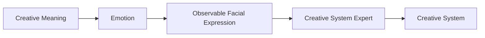
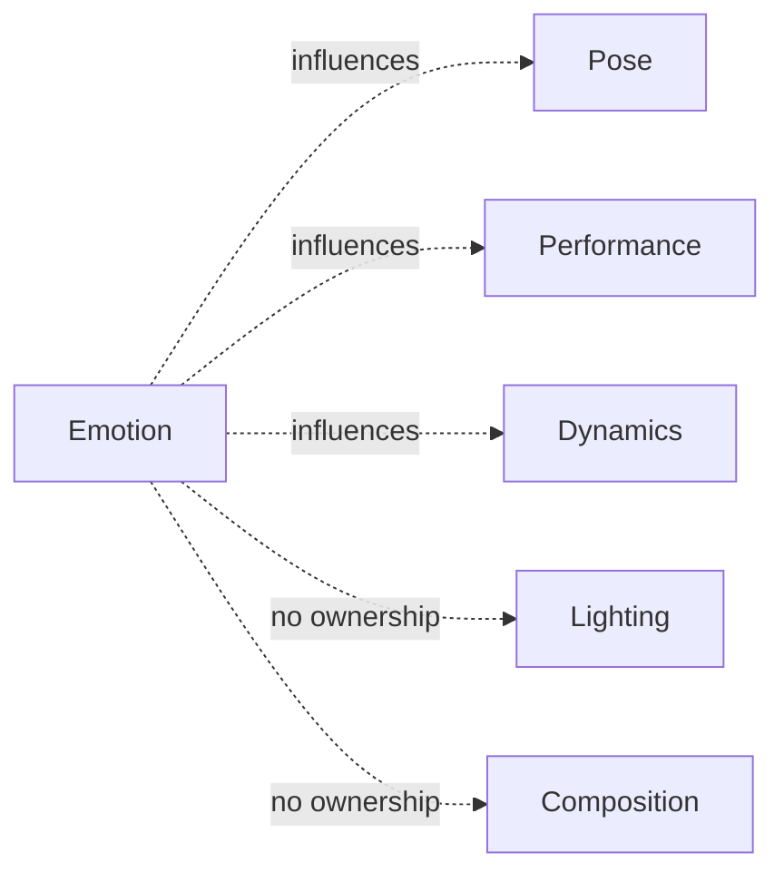
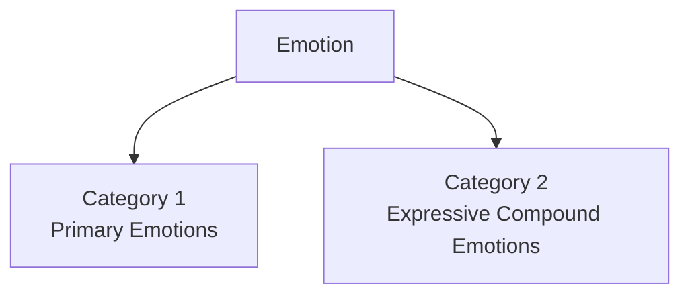
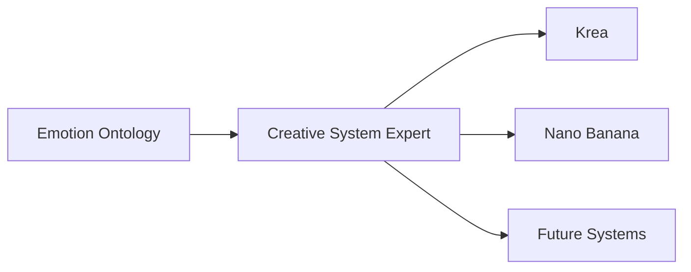

# Emotion Ontology

> **A renderer-independent ontology describing observable facial expressions rather than psychological states.**

---

## Fundamental Directive

The Emotion Ontology represents **only observable facial expression**.

It never describes:

- body posture
- gesture
- body movement
- camera
- lighting
- composition
- narrative
- rendering techniques
- implementation details

Every entry must remain:

- anatomically accurate
- visually observable
- renderer independent
- semantically composable with every other VizClick ontology

---

# Purpose

The Emotion Ontology provides reusable Creative Knowledge describing how emotional states become visually recognizable through facial expression.

Rather than defining what a subject feels internally, the ontology describes the observable facial characteristics that allow an observer to recognize that emotion.

This distinction allows the ontology to remain both renderer-independent and highly descriptive for current AI image generation systems.

---

# Why This Ontology Exists

During the development of the first reference implementation, **Krea Expert V1**, an important observation emerged.

Current AI image generation systems do not consistently interpret abstract emotional labels such as:

- joy
- sadness
- fear
- anger
- pride

However, they respond far more consistently to detailed descriptions of observable facial anatomy.

For example:

Instead of:

> Joy

A renderer understands more reliably:

> Cheeks elevate noticeably, gently compressing the lower eyelids while the corners of the mouth lift into a broad symmetrical smile...

The Emotion Ontology therefore bridges creative intent with observable facial expression.

---

# Scope

The Emotion Ontology V1 is intentionally designed for **human and human-like facial expressions**.

This decision reflects the goals of the first reference implementation, **Krea Expert V1**, whose primary creative domain consists of humans, portraits, fashion, advertising, cinema, and humanoid characters.

The ontology therefore describes observable human facial anatomy, including features such as:

- Eyebrows
- Forehead
- Eyelids
- Eyes
- Nose
- Cheeks
- Lips
- Mouth Corners
- Jaw
- Chin
- Facial Muscle Activation

These anatomical references are not intended to imply that emotional expression is exclusive to human morphology.

Instead, they provide a practical and highly descriptive foundation for current image generation systems, which demonstrate the strongest understanding of detailed human facial anatomy.

Future versions of VizClick may introduce a **Universal Expression Ontology** that abstracts these concepts into species-independent facial regions, allowing the same Creative Meaning to be represented across robots, creatures, animals, stylized characters, and future digital actors.

Possible future concepts include:

- Upper Facial Region
- Visual Organ Region
- Mid Facial Region
- Oral Region
- Lower Facial Region
- Surface Deformation
- Expression Tension

This evolution preserves the VizClick architecture while expanding the ontology beyond human anatomy.

The Emotion Ontology V1 should therefore be understood as the **first reference implementation** rather than the final architectural destination.

---

> **Design Principle**
>
> VizClick validates architectural ideas through concrete reference implementations before generalizing them into universal representations.

---

# The Representation Problem



Humans naturally communicate using abstract emotional concepts.

Examples include:

- joy
- grief
- fear
- relief
- determination

Current AI renderers, however, synthesize visual results more reliably from observable facial characteristics than from abstract psychological terminology.

The purpose of this ontology is therefore not to define emotions psychologically.

Its purpose is to define how emotions become visually observable.

---

# Domain Responsibility



The Emotion Ontology owns only facial expression.

It intentionally excludes:

- pose
- body posture
- gesture
- movement
- camera
- lighting
- composition
- narrative

Those responsibilities belong to independent ontologies.

This separation allows ontology entries to be combined without semantic conflicts.

---

# Domain Purity Principle

Every ontology owns only the semantic properties assigned to its domain.

Relationships may exist between domains.

Descriptions must remain independent.

Emotion influences Pose.

Emotion influences Performance.

Emotion influences Dynamics.

Emotion never contains them.

---

# Renderer Independence

The Emotion Ontology never contains:

- prompts
- renderer syntax
- FACS Action Units
- implementation details
- software-specific terminology

Instead, it describes only observable facial anatomy.

Each Creative System Expert determines how those observations should be represented for a specific destination system.

---

# Ontology Structure



The Emotion Ontology V1 consists of two categories.

## Category 1 — Primary Emotions

Thirty carefully selected primary emotions.

Each emotion contains two intensity levels:

- Moderate
- Expressive

Total:

30 × 2 = **60 entries**

---

## Category 2 — Expressive Compound Emotions

Approximately forty carefully curated compound emotions based on the most common emotional performances found in portraiture, cinema, photography, and acting.

Only expressive variants are included.

This decision maximizes visual clarity for current AI renderers.

Examples include:

- Joy with Relief
- Joy with Surprise
- Fear with Surprise
- Fear with Relief
- Anger with Disgust
- Sadness with Hope

Total:

Approximately **40 entries**

---

# Official Entry Schema (V1)

Every entry follows the same anatomical order.

```text
============================================================================
VIZCLICK ONTOLOGY

Emotion Ontology

Category X

Entry ###

============================================================================

Name

Description:

Eyebrows...

Forehead...

Upper eyelids...

Eyes...

Lower eyelids...

Nose...

Cheeks...

Lips...

Mouth corners...

Jaw...

Chin...

Overall facial muscle activation...
```

Maintaining a consistent anatomical order improves readability, consistency, and future translation by Creative System Experts.

---

# Translation Through Creative System Experts



The Emotion Ontology remains unchanged.

Only its representation changes.

Examples:

Krea Expert

↓

Detailed anatomical descriptions.

Nano Banana Expert

↓

FACS Action Units.

Future Experts

↓

Renderer-specific representations.

The ontology itself never changes.

---

# Quality Standard

Every descriptor should be written as if reviewed collaboratively by:

- a facial anatomist
- a professional acting coach
- a portrait photographer
- a facial animation supervisor

Every sentence should answer a single question:

> **Will this anatomical description help a renderer synthesize a more believable facial expression?**

If the answer is no, the description should be refined.

---

# Guiding Principle

> **An emotion is not what the subject feels.**
>
> **An emotion is the visible facial evidence that allows an observer to recognize what the subject feels.**